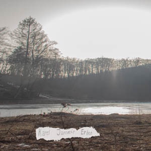

+++
title = 'Fotografie'
date = 2023-01-15T09:00:00-07:00
draft = false
+++

# Kytice 2021

Fotokniha s inscenovanými fotografiemi zaměřenými na pohádky, vznikla jako maturitní práce. Kniha obsahuje fotografické zpracování balad z knihy Kytice od Karla Jaromíra Erbena. Každá série se nese v duchu balady, kdy si udržují jednotný vizuál a koncept.

Text k maturitní práci
[Text k maturitní práci](https://www.google.com)

# Blechy 2020

Můžete jet tolikrát tou stejnou šalinou a říkat si, že už jí nikdy nepojedete znovu. Můžete se tolikrát smát, lhát, plakat, milovat, umírat a myslet si, že takhle jste se cítili poprvé a naposledy. Že všechno má svůj začátek a konec. Taky jsem si to myslela, a tak jsem svoje pocity začala psát. Chvilku mi to trvalo, ale potom mi rázem došlo, že začátek a konec znamená to samý, že oba dva jsou stejně veselý, prolhaný, uřvaný, milující a mrtvý. Že zase jedu tou stejnou šalinou. Kniha vznikala během prvního nouzového stavu v Čechách, a tak se autor snažil vnést do téhle doby radost. Proto si vizuál knihy hraje s barvami a fonty, které zaujmou i pobaví. Hlavní inspirací byla autorovi padesátá až osmdesátá léta. Fotografie v knize byly zpracovány formou analogové fotografie, aby dodaly na dobové věrnosti.

_Barbora Gazdová_

# Fantazie 2019

Fantasie je cyklus inscenovaných fotografií, jež si divák prohlíží, zkoumá či domýšlí. Jednotlivé série dodávají základní konstrukci příběhu opletenou záhadou a je na divákovi, jak si daný příběh doplní a vysvětlí. Proto může vznikat nekonečně mnoho dalších variant příběhu. Proto má každá série své vlastní specifické pojetí vizuálu a formátu.

