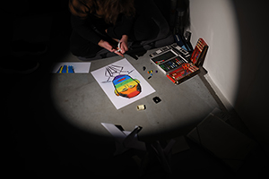

+++
title = 'Performance'
date = 2024-04-05T18:19:50+02:00
draft = false
+++

# POHLED Z OKRAJE PASTINY (SYMPOZIUM) 2022

Performance byla součástí programu mezinárodního sympósia A view from the edge of a pasture, který organizovala Edith Jeřábkova a Denisa Langrová. Symposium je části jednoletého programu nazvaný A plant spadající pod Kunsthalle Bratislava, který organizuje Lydia Přibišová. Workshopy jsou součásti projektu Art Connected 2022 – 2023 iniciované společností tranzit.sk.

Tento projekt byl kolektivně iniciovaný Ateliérem Tělového Designu z Fakulty výtvarných umění v Brně. Performance byla založena na myšlence pohybu ovcí a pastýřů, kvůli obnově půdy a trávy. Plstění vlny do země jako akt, by mohl být metaforou pro spojení s pastvinou: potřeba zakořenit v době odpojení od přírody, kolonialismu, (zne)užívání zdrojů, potřeby odkazu, najít správné místo nebo kapitalistické potřeby produkování a opuštění bez zodpovědnosti.

Performance začala hledáním „správného“ místa a pokračovala zakořeněním vlny. Vlnu jsme si přinesly ve čtvercových kusech bavlněného oblečení, které po vyložení vlny byly využity jako zástěry. V hromadě vlny stála jedna osoba, přednášející její poezii a my jsme poezii hromadně jako sbor opakovali ve snaze vytvořit meditativní zpěv a přitom jsme plstili vlnu do půdy a přednášeli poezii ve smyčce.

Foto: Jamie Hrabců a archiv autora


  
# Já Vs. Putin 2022

V rámci performance v Nové synagoze v Žilině jsem se rozhodl reflektovat situaci útoků Ruska na Ukrajinu, které proběhly v roce 2022. Proto jsem ve své performance tvořil portréty ruského prezidenta Vladimira Putina. Zároveň jsem chtěl znázornit sociální a politické nespravedlnosti, které jsou v ruské společnosti a politice přítomné. Specifické, charakterově nestejné/rozdílné portréty jsou znázorněny za pomocí barev, s kterými se tyto problémy mohou identifikovat. Těmi hlavními problémy, jež jsem zobrazoval, je útok Ruska na Ukrajinu, LGBT práva v Rusku, dezinformace, oligarchy, jež ovlivňují chod Ruska, styky s Čínou a jaderné zbraně. Portréty byly tvořeny pastelem na papír velikosti A3 a poté z nich byla složena holubička, která symbolizuje mír.

Foto: Karolina Kohoutková a archiv autora

# Klouby 2021

Performance proběhla v prostorách invalidovny, která má rozmanitou historii s ošetřováním invalidů. V důsledku toho, že spousta nemohoucích mohlo mít různé dysfunkce, se autor rozhodl v těchto prostorách prozkoumat sám, jaké to musí být fungovat s omezením. Proto si autor zafixoval klouby různými předměty, sádrovými obvazy a nachystal pro všechny hosty jednohubky.

Ovšem se ukázalo, že to je mnohem náročnější, než jak se může zdát. Nikdy předtím neměl autor na sobě sádru a sádrové obvazy používal poprvé. Proto už od samého začátku to byla výzva používat sádrové obvazy a pořádně si zafixovat části těla. Jak na to přišel, čekal jej další zádrhel a to s fixací rukou. První ruka šla ještě dobře, se druhou rukou mu pomohla sledující.

V průběhu celé performance si autor připadal jako dítě, jelikož se musel naučit dělat obyčejné věci s touto indispozicí a objevoval nové způsoby. Díky tomu mohl vyzkoušet jaké to asi je, žít s překážkami v životě a přizpůsobovat se daným věcem.

Foto: Fotograf

Video: Lenka Klódová 

 