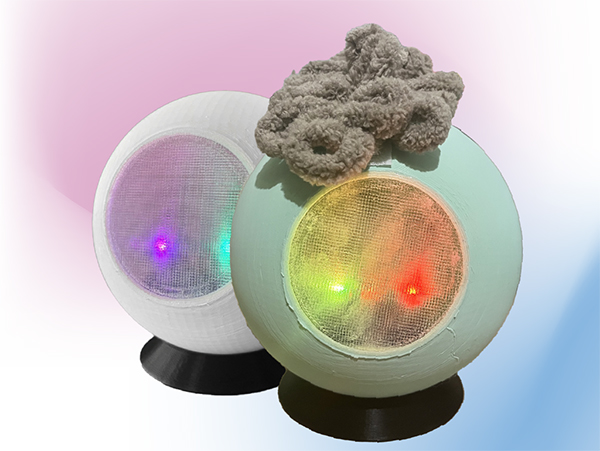
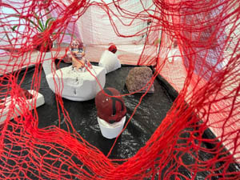
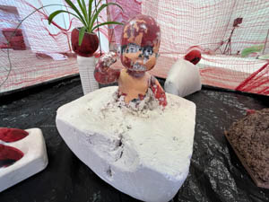

+++
title = 'Volné umění'
date = 2024-04-05T18:20:18+02:00
draft = false
+++

# Esence pravé vyrovnanosti 2024

ESENCE PRAVÉ VYROVNANOSTI je dílo adaptující příběh z Taoismu, o tom jak císař hledal pravou vyrovnanost. Stejně tak to měl i autor díla, který se nedokázal v jistou chvíli řádně soustředit na svou práci, a tak zpracoval obrazy z příběhu dle své volné interpretace. Pro autora je tento projekt osobní záležitostí a silně věří, že toto dílo mu pomůže najít klid, vyrovnanost a koncentraci při dalším tvoření.

[Dokumentace projektu](https://honzamikulica.cz/zdroje/volneumeni/Tranquility_Documentation.pdf)



# Puff 2023

Yo-Yo machines jsou hravá zařízení pro nonverbální komunikaci mezi lidmi. Zařízení posílá světelné signály, mechanické pohyby a zvuky. Yo-Yo Machines jsou open-source produktem studia Interaction Research Studio. Light Touch je konkrétní zařízení, které umožňuje posílat světelné signály s dalšími lidmi přes internet. Můžete si vybrat barvu, kterou odešlete svému kamarádovi a pošlete barvu na druhé zařízení. Můžete signály odesílat hned nebo později.

Puff – zařízení pro kamarády, partnery a milence
V době mobilních telefonů toto zařízení může být neužitečné, ale se všemi SMS, MMS, smajlíky. Ztrácíme část intimity v komunikaci. Původně autor zamýšlel zkombinování dvou Yo-Yo machines: Light Touch a Knock Knock. V průběhu práce si uvědomil náročnost dané techniky. Tvorba byla velmi dlouhá, ale zde je Puff!

[Prezentace](puff/puffpresentationcz.pdf)

# My little abortion 2021

Projekt zabývající se tématem interrupcí, které jsou velmi řešeny v Polsku, Slovensku, Maďarsku, USA a v dalších zemí. První ideu zabývat se tímto tématem dostal autor na protestu v Praze před Slovenskou ambasádou v roce 2021, kde padla myšlenka toho, že i když u nás nejsou interrupce zakázaný, tak je stále možné, že i podobná situace může v České republice nastat. V průběhu práce na projektu se autor zabýval také tématem čarodějnictví, kdy objevil spojitost mezi tím jak byly ženy utlačovány kdysi a jak jsou utlačovány dnes, tím že se jim snaží odebrat práva na interrupce. Projekt má upozornit na daný problém. Proto vytvořil sérii sošek.

Dané sošky jsou tvořeny z hlíny a sádry. Jako základ byla použita součást z těla hračky miminka či panenky, která byla spojena s hlínou nebo sádrou. Ze začátku tvořil za pomoci hlíny, později začal také využívat sádru, u které objevil nový způsob využití. Jelikož sádru většinou naléval do objektů, aby vznikl nějaký tvar, tak byl výsledek kolikrát velmi překvapivý na rozdíl od hlíny, kde celé torzo tvořil sám, tak jak si představoval.

Ale takový osobní průlom pro autora přišel ve chvíli, kdy tvořil sochu, kde celé tělo miminka zalil v sádře a poté vykutával za pomocí dláta. Tahle socha byla velmi vyčerpávající a časově náročná. Byl to takový jakýsi porod, a i lidé v autorově okolí tuhle sochu začali připodobňovat porodu, proto se rozhodl, že sochu nazve Nedokončený porod. Sochy jsou vystaveny v ohrádce, která zpodobňuje dětský koutek. Ohrádka je vytvořena sítí, na níž jsou pověšeny novinové články, které souvisí s kauzami a událostmi spojené s interrupcemi.

